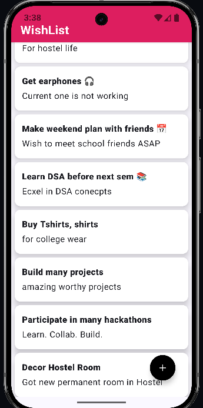
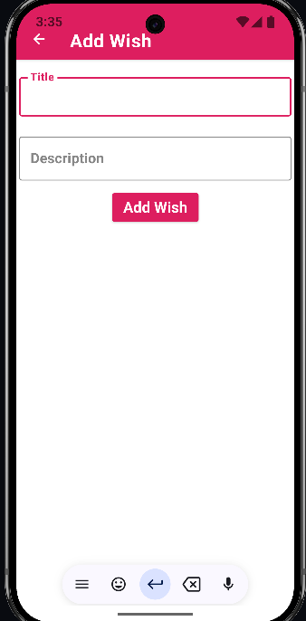
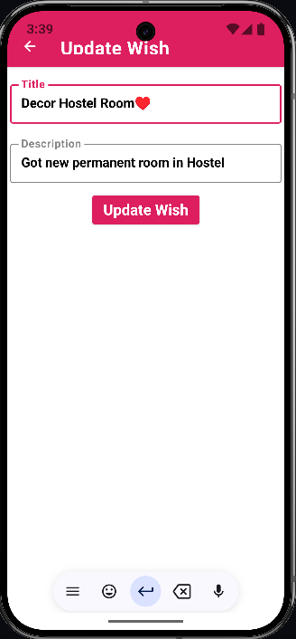
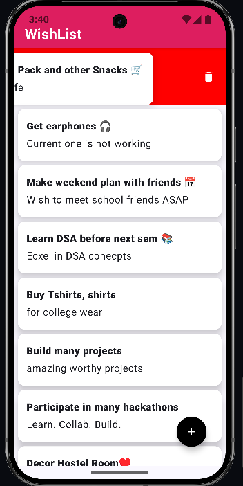

# 📋 MyWishlistApp

A simple Android Wishlist Manager built with 💖 using **Jetpack Compose**, **Room Database**, and **Kotlin**.

## ✨ Features
- 📝 Add and update wishlist items
- 💾 Local data storage with Room DB
- 🔄 Drag-and-drop item reordering
- 🗑️ Swipe-to-delete functionality
- 🧠 Clean MVVM architecture
- 📱 Built with Jetpack Compose for modern UI

## 🛠 Tech Stack
- Kotlin
- Jetpack Compose
- Room Database
- MVVM Architecture
- Android Studio

## 📸 Screenshots
### WishList


### Add Wish Screen


### Update Wish Screen


### Delete Wish


## 🚀 Getting Started
Clone the repo and open in Android Studio:

```bash
git clone https://github.com/CodeFun1001/MyWishlistApp.git
